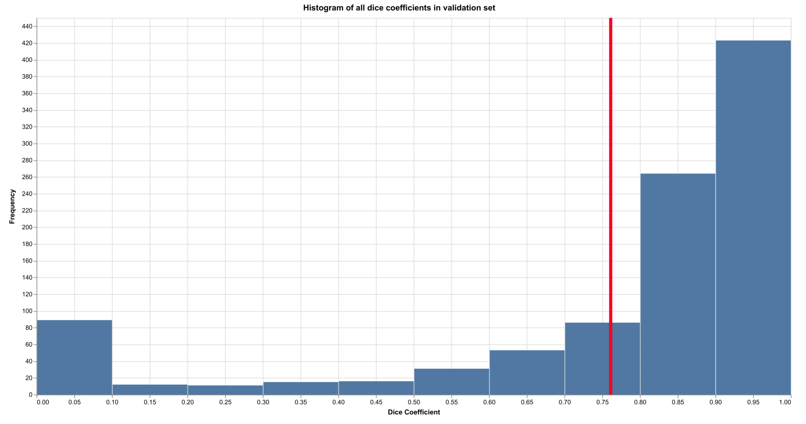

# Solar panel identification in satellite imagery

A neural network based pipeline for identifying solar panels in satellite image data.

**STATUS:** functional proof of concept

My goal is to be able to input any satellite image of sufficiently high resolution and get back a list of PV (photovoltaic) locations as well as polygon shapes. We're not quite there yet but the machine learning part works well now.

---

We use the [U-Net neural network architecture](https://arxiv.org/pdf/1801.05746.pdf), (an encoder-decoder design with extra pathways) along with pre-trained VGG16 weights for the encoder half. A U-net architecture is generally considered to be the state of the art for image segmentation (identifying different regions in an image). Using pre-trained VGG16 weights minimises the need to train the complete network from scratch, which cuts days off the training time.

All our training data comes from a data collection prepared by [Bradbury et al.](https://www.nature.com/articles/sdata2016106). This wouldn't be possible without their work!

The [included weights](./Data/model.h5) are from a model trained for 100 epochs with 9,500 training images.
This model has a *mean dice coefficient* of 0.7 over the validation image set, which is pretty reasonable for such a short training time (about 11 hours on a Tesla K80 GPU).

## The Dataset

I am using data gathered by [Kyle Bradbury and co-workers](https://www.nature.com/articles/sdata2016106). They provide high resolution (30 cm) RGB satellite images for four Californian cities - Fresno, Oxnard, Modesto and Stockton, along with hand-labelled polygons for every PV installation in each image. While I have not included the dataset in this repository, you can run the `download_data.sh` script to get it all (about 50GB) from FigShare.

## Brief outline of the pipeline

1. Convert the geojson polygons in the dataset into binary image masks.
2. Create small tiles of these masks along with their associated satellite images
3. Split these tiles into training and testing sets.
4. Filter the tiles that contain at least 1px of solar panel and only use these for training the model (mainly for efficiency reasons)
5. Train the U-Net model using the [Sørensen–Dice Coefficient](https://en.wikipedia.org/wiki/Sørensen–Dice_coefficient) as the loss metric. This metric measures the similarity between two sets of data (the ground truth mask and the predicted mask, in our case).

## Planned improvements

I would still like to improve this project in several ways. These approaches will be implemented shortly:
* **larger training set:** Right now, we are only training on images that contain at least 1px of solar panel, but including more images will help.
* **image augmentation:** rotating, skewing, scaling and corrupting the training images prior to training to improve accuracy on other satellites
* **hyper-parameter optimisation:** Investigate if [Tversky loss](https://arxiv.org/pdf/1706.05721.pdf) can improve results (preliminary experiments I made don't suggest that).
* **post-prediction stitcher:** Incorporating a tile stitcher such as [this one](https://github.com/Vooban/Smoothly-Blend-Image-Patches)
* **pre-screening:** Right now, we run all images through the model to get prediction masks. However, in many instances, we can pre-screen images (or regions of a large image) using a much simpler computer vision model such as [MSER](https://www.researchgate.net/publication/300416092_Automatic_solar_photovoltaic_panel_detection_in_satellite_imagery) to save time.
* **Easy-to-use web app with visualisations:** A custom D3 solution would be nice

## Improvements I would like to make if I had more resources

* **satellite images with more channels:** Adding a digital surface model data or an NDVI-like channel would likely help a lot. However, this data can be difficult to obtain.
* **larger image tiles:** Right now, we are using a pre-trained VGG16 model which limits tile size to 224x224. However, training the model from scratch will allow us to work with much bigger tiles, reducing the errors in prediction near the edges of images (where PVs are cropped out partially). We could also use an alternative pre-trained model but this would require GPUs with much more memory.
* **OpenStreetMap data:** The [OpenStreetMap database](https://overpass-turbo.eu/s/BS0) contains data on many solar PV installations from across the world. In theory, we can use much of this for our training data. However, the quality may be sub-par or the data may be tricky to use, as satellite imagery and coordinates may not align exactly.
* **wind turbines:** It would be nice to be able to identify wind turbines across the world, but this is just a stretch goal.

## Credits

All our training data comes from a data collection prepared by [Bradbury et al.](https://www.nature.com/articles/sdata2016106). This wouldn't be possible without their work!

Thanks to [this article](https://microsoft.com/developerblog/2018/07/05/satellite-images-segmentation-sustainable-farming/) and the [associated Github repository](https://github.com/olgaliak/segmentation-unet-maskrcnn) by [Olga Liakhovich](https://github.com/olgaliak) for the U-net code.
